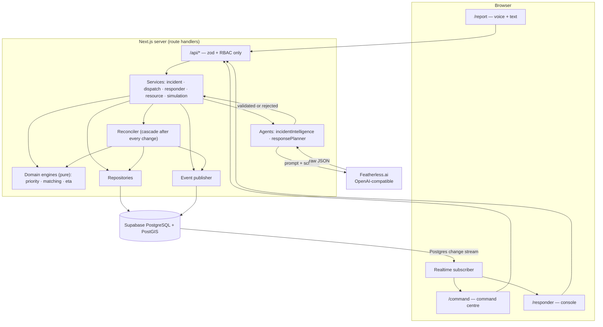

# ReliefOS

**Real-time AI emergency coordination operating system.**
*From scattered reports to coordinated action.*

ReliefOS turns fragmented emergency reports into prioritized, explainable and coordinated
response actions — and keeps re-deciding as conditions change.

```
REPORT → UNDERSTAND → VALIDATE → CLASSIFY → ASSESS → PRIORITIZE → FIND RESOURCES
       → MATCH → PLAN → HUMAN APPROVAL → DISPATCH → TRACK → REPLAN
```

---

## The problem

During a flood, a fire, a building collapse, information is fragmented across citizens,
responders, volunteers, shelters and coordinators — and it keeps changing.

The hard problem is **not** collecting reports. Report-collection apps already exist. The hard
problem is the one a human coordinator is drowning in:

> Given everything known right now — which is incomplete, partly wrong, and changing every
> minute — what should happen next, who should do it, and why?

That question has to be answered again every time a new report arrives, a responder becomes
unavailable, a shelter fills up, or a caller adds one more detail. Traditional reporting tools
show a list. They do not decide, they do not explain, and they do not adapt.

### Why this matters

The delay between "we know" and "someone is on the way" is where preventable harm happens. A
coordinator holding twelve simultaneous incidents cannot re-derive optimal allocation by hand
every time one variable moves — so allocation quietly goes stale, and the most vulnerable
person in the queue is not always the one who gets help first.

---

## The solution

ReliefOS is a lightweight **AI emergency operations centre**. A citizen reports by voice or
text; the system understands the report, scores its priority, searches for compatible help,
recommends a specific responder with reasons, waits for a human to approve, dispatches, tracks,
and re-plans automatically when the situation changes.

**Three roles:** citizens report at `/report`, coordinators run `/command`, responders work
from `/responder`.

---

## How ReliefOS works

| Stage | What happens | Where it lives |
|---|---|---|
| Report | Voice (Web Speech API) or text, both posting to the same endpoint | `app/report`, `app/api/incidents` |
| Understand | Featherless model extracts structured operational data | `lib/agents/incidentIntelligence.ts` |
| Validate | Four gates: transport → parse → zod schema → bounds | `lib/ai/validate.ts` |
| Prioritize | Deterministic engine over the validated fields | `lib/domain/priority.ts` |
| Find resources | PostGIS `ST_DWithin` / `ST_Distance` candidate search | `nearby_capable_responders()` |
| Match | Deterministic scoring, with exclusions and reasons | `lib/domain/matching.ts` |
| Plan | Featherless model picks among the top 3 and justifies it | `lib/agents/responsePlanner.ts` |
| Approve | Coordinator commits. Nothing is dispatched without this. | `app/api/assignments/[id]/approve` |
| Track | Responder state machine, all persisted | `lib/services/dispatchService.ts` |
| Replan | The reconciler recomputes the blast radius of every change | `lib/services/reconciler.ts` |

---

## System architecture



**The AI never writes to the database.** It returns a proposal; the service validates it, the
deterministic engines score it, the repository persists it, the event publisher announces it,
and only then does any UI change.

---

## AI architecture

Two model stages, both load-bearing, plus deterministic engines that do the arithmetic.

### Agent 1 — Incident Intelligence

Input: the raw report text and a location hint.
Output (strict zod schema):

```jsonc
{
  "hazard_type": "flood",
  "severity": "critical",
  "people_affected": 2,
  "vulnerability_flags": ["elderly", "isolated"],
  "life_risk": true,
  "required_capabilities": ["flood_rescue", "boat"],
  "urgency": 0.94,
  "confidence": 0.91,
  "missing_information": ["exact floor number"],
  "short_summary": "Two people trapped on flooded ground floor, one elderly"
}
```

### Agent 2 — Response Planner

Given the top three candidates the deterministic engine already ranked, the model chooses one
and justifies it in three bullets. **Guard rail:** if it names a responder outside the
shortlist, the output is rejected and the deterministic rank-1 candidate stands. It can reorder
within a shortlist it was handed; it can never conjure a responder, and it can never lower the
human-approval requirement.

### How AI output changes system behaviour

This table is the direct answer to "is the AI decorative?"

| AI field | What it changes | Code |
|---|---|---|
| `severity` | 7–34 points of priority score | `lib/domain/priority.ts` |
| `life_risk` | +12 points; drives escalation to CRITICAL | `lib/domain/priority.ts` |
| `vulnerability_flags` | up to +16 points, weighted per flag | `lib/domain/weights.ts` |
| `people_affected` | up to +16, logarithmic | `lib/domain/priority.ts` |
| `urgency` | up to +14 points | `lib/domain/priority.ts` |
| `confidence` | up to −6 points; caps at 0.35 when the fallback runs | `lib/domain/priority.ts` |
| `required_capabilities` | the SQL predicate of the PostGIS candidate search, and the capability-coverage term of every match score | `nearby_capable_responders()`, `lib/domain/matching.ts` |
| `hazard_type` | specialization bonus, incident code prefix | `lib/domain/matching.ts` |
| `missing_information` | the follow-up questions shown to the reporter | `app/report` |
| planner's choice | which responder is recommended, and the rationale shown to the coordinator | `lib/services/matching.ts` |

Change the report and the fields change; change the fields and the score, the candidate set,
the ranking and the recommendation all change. There is no branch anywhere in the codebase that
hardcodes a decision.

---

## Featherless integration

Featherless.ai is the inference provider for both agents, called server-side only.

```
lib/ai/provider.ts      AIProvider interface · FeatherlessProvider (OpenAI-compatible client)
lib/ai/schemas.ts       zod schemas — the contract the model must satisfy
lib/ai/prompts.ts       system prompts (JSON only; reasoning text explicitly forbidden)
lib/ai/validate.ts      the validation ladder
lib/ai/fallback.ts      deterministic keyword extractor — NOT an AI
lib/repositories/decisions.ts   every call recorded in ai_decisions
```

Configuration (never `NEXT_PUBLIC_`, never committed):

```
FEATHERLESS_API_KEY=
FEATHERLESS_BASE_URL=https://api.featherless.ai/v1
FEATHERLESS_MODEL=
FEATHERLESS_MODEL_FALLBACK=
```

### The validation ladder

1. **Transport** — at most three attempts, with backoff: the call, then a retry without
   `response_format` (some models reject it), then the fallback model. Statuses a retry cannot
   fix — 400, 401, 403, 404, 422 and 429 — fail immediately rather than being hammered; a
   provider that is already rate-limiting us is not helped by a tight retry loop. There are no
   unbounded retries anywhere in the codebase.
2. **Parse** — first balanced JSON object extracted, tolerating markdown fences and stray prose.
3. **Schema** — `zod.safeParse`. On failure, ONE repair call feeding the model its own output
   plus the exact validation errors.
4. **Bounds** — cross-field sanity the schema cannot express; out-of-range values clamped
   (`validation_status = 'repaired'`), unknown enum members dropped, never invented.

If all of that fails, the deterministic extractor in `lib/ai/fallback.ts` runs. It caps
confidence at 0.35, sets `degraded = true` on the incident, emits `system.degraded`, and the UI
shows a **RULE-BASED ASSESSMENT** badge. We would rather show a coordinator a visibly weaker
assessment than silently pretend the model succeeded.

**Every outcome — valid, repaired or rejected — is written to `ai_decisions`** with the model
name, latency, token counts, raw output and error text. Open that table during the demo: it is
the receipt for every decision the system made.

---

## Priority engine

Deterministic, configurable (`lib/domain/weights.ts`), reproducible, unit-tested.

```
score = clamp(0, 100,
    SEVERITY[severity]                        // critical 34 · high 25 · medium 15 · low 7
  + (life_risk ? 12 : 0)
  + min(16, Σ VULNERABILITY[flag])            // unconscious 12 · injured 9 · infant 8 · elderly 7 …
  + min(16, 5.5 · log2(1 + people_affected))  // diminishing returns
  + 14 · urgency
  + min(8, 0.2 · minutes_awaiting_dispatch)   // waiting incidents climb on their own
  + 6 · (1 − capability_supply_ratio)         // scarcity of the capability they need
  − 6 · (1 − ai_confidence)                   // uncertainty penalty
)

band: ≥75 CRITICAL · ≥55 HIGH · ≥32 MEDIUM · else LOW
```

Every term is written to `decision_factors`, which is what the **"Why this priority"** panel
renders. The model supplies observations; arithmetic makes the decision.

The last two terms are what make this a system rather than a form: an incident's priority
depends on how long it has waited and on whether the responders it needs still exist.

---

## Need ↔ Help matching

Candidates come from PostGIS:

```sql
select … from responders
where capabilities && $required_capabilities
  and ST_DWithin(current_location, $incident_point, $radius_m)
order by ST_Distance(current_location, $incident_point);
```

**Hard gates** (excluded, with the reason persisted and shown in the UI): offline · busy · no
capability overlap · at maximum load · outside the 25 km radius · already committed to a
comparable-priority incident.

**Score, 0–100:** capability coverage 30 · availability 20 · proximity 20·e^(−km/8) ·
estimated response time 15 · workload headroom 10 · hazard specialization 5.

Below 50 the system refuses to auto-recommend and raises **NO STRONG MATCH — manual assignment
required** rather than inventing a decisive-looking answer.

---

## Dynamic reprioritization

`lib/services/reconciler.ts` runs after every state change and works out the blast radius:

| Change | What the reconciler does |
|---|---|
| Responder goes offline | Invalidates their assignment, re-prices and re-matches the stranded incident, re-scores everyone waiting on their capability |
| New CRITICAL incident | Scarcity term rises for competing incidents |
| Reporter adds detail | New assessment version → new priority → possible band change → re-match |
| Shelter capacity drops | Evacuation-dependent incidents re-priced, coordinator notified |
| Responder declines | Candidate invalidated with reason, next best recommended |
| Time passes | Undispatched incidents age upward and can cross a band boundary unaided |

---

## Conflict resolution

Two incidents wanting the same responder is resolved **in Postgres**, not in application logic
that might be wrong:

```sql
create unique index one_active_assignment_per_responder
  on assignments (responder_id)
  where status in ('dispatched','accepted','en_route','on_scene');
```

When approval trips that index (`23505`), `dispatchService` catches it and: marks the
assignment invalidated with a reason → emits `match.invalidated` → re-prices the incident →
re-runs matching excluding that responder → writes a new recommendation → notifies the
coordinator → returns **409** with the alternative. A race between two coordinators cannot
corrupt the database; the loser gets a new recommendation.

**Preemption** is offered, never taken: a responder already en route is only surfaced as a
candidate when the new incident outranks theirs by 15+ points, and taking them requires
explicit approval.

---

## Human-in-the-loop

`AUTO_DISPATCH_ENABLED` defaults to `false`, so every dispatch is human-approved. Even with it
on, approval is still mandatory for CRITICAL and HIGH incidents, any preemption or
reassignment, and any match scoring below 70. AI recommends; a person commits.

---

## Real-time architecture

The append-only `system_events` table **is** the realtime bus: timeline, audit trail and live
feed are the same rows, so nothing can appear in the UI that did not happen in the database.

```
incident.created        incident.updated       incident.priority_changed  incident.resolved
ai.assessment_created   ai.assessment_rejected
responder.status_changed  responder.location_changed
match.created           match.invalidated
assignment.created      assignment.accepted    assignment.declined
assignment.updated      assignment.cancelled
resource.updated        shelter.capacity_changed
notification.created    simulation.step_executed    system.degraded
```

The client subscribes to inserts on that table. Each event lands in the timeline immediately
and triggers a debounced re-read of authoritative state from `/api/state`. If a `seq` gap
appears — a dropped packet — the missing events are replayed from `/api/events?after_seq=`. If
the socket is unhealthy the client falls back to polling and the header shows
**LIVE / RECONNECTING / OFFLINE**.

---

## Database design

Supabase PostgreSQL 17 with PostGIS. Schema in `supabase/migrations/`.

`profiles` · `incidents` · `incident_assessments` (versioned) · `responders` ·
`responder_locations` · `resources` · `shelters` · `shelter_capacity_events` ·
`match_candidates` · `assignments` · `ai_decisions` · `decision_factors` · `system_events` ·
`notifications` · `simulation_runs` · `app_config`

Two schema decisions worth stating plainly:

- **No separate `incident_events` or `audit_logs` tables.** `system_events` already carries
  actor, entity, correlation id and payload; those tables would be the same rows written twice.
- **Capabilities are `text[]` with a GIN index, not a join table**, because nothing in this
  system ever queries capabilities independently of a responder.

Empty tables would score worse with a judge than absent ones, so they are absent and explained.

---

## Voice interface

Speech is transcribed in the browser with the Web Speech API and posted to the **same**
`POST /api/incidents` endpoint the textarea uses, with `source: "voice"`. There is no separate
voice code path and no separate voice demo. Browser speech recognition works in Chrome and
Edge; everywhere else the textarea is the reporting surface and the UI says so.

---

## Simulation Mode and Chaos Mode

Neither is a special code path. Both call the same services a real user hits, so every row they
create is a real row and every event is a real event. Simulated rows carry `is_simulated` and
the command centre shows a **SIMULATION MODE** banner.

**Chaos Mode** runs a server-owned script:

```
T+0s   flood report: family trapped on the ground floor
T+8s   second report: four people stranded on a rooftop
T+18s  Alpha Rescue goes offline (vehicle stuck)
T+28s  critical report: elderly woman unconscious
T+38s  Sunrise Community Hall capacity drops by 130
T+48s  reporter adds "two more neighbours, one injured"
T+58s  road congestion rises to ×1.6
T+68s  time-pressure recalculation across the open queue
```

The system responds by reprioritising, invalidating stale matches, finding alternatives,
updating assignments, and pushing every change to the map and timeline.

> **Honest limitation:** Vercel's serverless runtime has no durable background worker, so the
> browser pokes `POST /api/simulation/chaos/tick` every 2.5 seconds. The **server** decides
> which steps are due from `started_at` and `current_step` and executes them through the
> ordinary services. The client is a metronome; it cannot cause a state change the server did
> not perform.

`POST /api/simulation/reset` deletes every simulated row. It is deliberately scoped: deleting the
simulated incidents cascades to their events, assessments, candidates, assignments, AI decisions and
notifications, and chaos-run bookkeeping is removed by run id. Events belonging to **real** reports
are left alone — an audit log a UI button can silently truncate is not an audit log.

---

## Security

- **Supabase Auth** with roles in `profiles` (citizen / coordinator / responder / admin).
- **RLS enabled on every table with zero client write policies.** The browser physically cannot
  write to the database. Every write goes through a server route handler using the service-role
  key after an explicit `requireRole()` check. Hiding a button is not access control.
- **Read policies** scope citizens to their own reports; operational data is staff-only.
- **Secrets server-side only.** `FEATHERLESS_API_KEY` and `SUPABASE_SERVICE_ROLE_KEY` are never
  prefixed `NEXT_PUBLIC_`. `.env.local` is gitignored; `.env.example` is committed empty.
- **Input validation** with zod on every request body and query parameter.
- **Rate limiting** on the public reporting endpoint, backed by a Postgres fixed-window counter
  (`consume_rate_limit`, defined in migration `0006_rate_limit.sql`) so the limit is shared across
  every server instance, with an in-process cache in front of it to absorb obvious floods before
  they reach the database. If that function is missing the code falls back to a per-process window
  and logs a loud warning — it never pretends the shared limit is in force. Apply migration 0006,
  or the published limit is not globally enforced on serverless.
- **Model output is data, never instructions.** It is parsed, validated and bounded before it
  can influence anything, and never interpolated into SQL.

## Privacy

Demo identities only. No real names, phone numbers or identity documents are collected or
stored, and `missing_information` never asks for them. Location is collected only to route
help. Every synthetic row is flagged `is_simulated`.

---

## Testing

```bash
npm test          # 49 unit tests: priority, matching, approval policy, AI validation
npm run typecheck # tsc --noEmit, strict mode, zero errors
npm run lint      # next lint (NOT skipped during builds)
npm run test:ai   # live Featherless call, validated against the schema
npm run verify    # full end-to-end check against a running instance + the live database
                  # (finds the server on ports 3000-3003; or: npm run verify -- http://localhost:3001)
```

`npm run verify` drives the real HTTP API and then reads the database to prove each step
happened: AI decision persisted, priority computed, factors stored, candidates scored,
recommendation created, approval changing state, double-booking refused, the reconciler firing,
and the event sequence remaining monotonic. It also submits a deliberately minor report and
asserts it scores far lower than the severe one — the anti-"hardcoded decision" check.

---

## Setup

```bash
git clone <repo> && cd reliefos
npm install
cp .env.example .env.local     # fill in the five values below
npm run dev                    # http://localhost:3000
```

Apply `supabase/migrations/*.sql` in order, 0001 through 0006 (Supabase SQL editor or
`supabase db push`). **0006 is required** — without it the shared rate limiter is inert.

> **Model choice matters.** Gated Hugging Face repositories such as `meta-llama/*` return
> **403** from Featherless unless your Featherless account is linked to a verified Hugging Face
> account. `Qwen/Qwen2.5-7B-Instruct` and `mistralai/Mistral-7B-Instruct-v0.3` work immediately.
> Verify yours with `npm run test:ai` before anything else.

| Variable | Where it comes from |
|---|---|
| `NEXT_PUBLIC_SUPABASE_URL` | Supabase → Project Settings → API |
| `NEXT_PUBLIC_SUPABASE_ANON_KEY` | same page (publishable) |
| `SUPABASE_SERVICE_ROLE_KEY` | same page (secret — server only) |
| `FEATHERLESS_API_KEY` | featherless.ai account |
| `FEATHERLESS_MODEL` | an **ungated** instruct model, e.g. `Qwen/Qwen2.5-7B-Instruct` |

Demo accounts (created by migration 0005, password `reliefos-demo`):
`coordinator@reliefos.com` · `responder@reliefos.com` · `citizen@reliefos.com`

Then: sign in as the coordinator → **Seed demo world** → report an emergency at `/report` →
approve the dispatch → **Start Chaos Mode**.

---

## API

| Method | Route | Role | Emits |
|---|---|---|---|
| POST | `/api/incidents` | public (rate-limited) | `incident.created`, `ai.assessment_created`, `incident.priority_changed`, `match.created` |
| POST | `/api/incidents/:id/updates` | public | `incident.updated`, `incident.priority_changed` |
| GET | `/api/incidents/:id` | staff | — |
| POST | `/api/incidents/:id/rematch` \| `/resolve` \| `/reassign` | coordinator | `match.created`, `incident.resolved`, `assignment.created` |
| POST | `/api/assignments/:id/approve` | coordinator | `assignment.created`, `responder.status_changed` |
| POST | `/api/assignments/:id/reject` | coordinator | `match.invalidated`, `match.created` |
| POST | `/api/assignments/:id/{accept,decline,arrive,complete}` | responder | `assignment.*` |
| PATCH | `/api/responders/:id/status` | responder | `responder.status_changed` + full cascade |
| PATCH | `/api/shelters/:id/capacity` | coordinator | `shelter.capacity_changed` |
| POST | `/api/simulation/{seed,chaos/start,chaos/tick,chaos/stop,reset}` | coordinator | `simulation.step_executed` |
| GET | `/api/state` · `/api/events?after_seq=` · `/api/system/status` | staff | — |

Auth accepts a Supabase session cookie or an `Authorization: Bearer <access_token>` header.

---

## Project structure

```
app/            routes + /api route handlers (validation and RBAC only)
components/     command centre, map, incident detail, UI primitives
lib/
  ai/           Featherless provider, schemas, prompts, validation ladder, fallback
  agents/       incident intelligence, response planner
  domain/       priority, matching, eta, weights   ← PURE, no I/O, unit-tested
  services/     incident, dispatch, responder, resource, reconciler, simulation, matching
  repositories/ the only code that talks to Postgres
  events/       event catalog + publisher
  realtime/     the subscriber hook
  auth/         RBAC
supabase/migrations/   the schema
tests/unit/     49 tests over the decision logic
docs/ARCHITECTURE.md   the full design of record
```

---

## Engineering decisions

**Next.js route handlers instead of a separate Python backend.** The brief's reference stack was
FastAPI. With a sub-14-hour window and a team fastest in TypeScript, a second service would have
cost integration time and bought nothing a judge can see. The service layer is real either way:
route handlers do validation and RBAC only, and every one of them delegates to a service.

**The event log is the realtime bus.** One table serves timeline, audit trail and live updates.
This makes decorative animation structurally impossible: the UI has nothing to render unless a
row exists.

**AI proposes, deterministic engines decide.** Scores are reproducible, unit-testable in
milliseconds, explainable from stored factors, and immune to a malformed model response.

**The conflict guard lives in Postgres.** A unique partial index cannot be bypassed by a race or
by a code path someone forgot to update.

**The reconciler runs synchronously.** Serverless has no durable worker; a synchronous cascade
traceable through one `correlation_id` beats a background job that silently dies.

---

## Limitations

Stated plainly, because a system that overclaims is not trustworthy:

- **Not connected to any live emergency service or hazard feed.** All incidents are
  user-submitted or clearly labelled simulation. This is real-time *application state*, not
  real-time emergency data.
- **ETAs are straight-line estimates**, not routed. No routing provider is integrated, and every
  ETA is labelled "est., straight-line" in the UI.
- **Chaos Mode is ticked by the browser** because serverless has no durable timer. The server
  owns the script, decides which steps are due from wall-clock time, and performs every state
  change; if the tab is closed and reopened the scenario catches up on the steps it missed
  rather than stalling. It does not advance while no tab is open.
- **The reconciler is synchronous**, so a very large cascade would slow the originating request.
- **Browser speech recognition is Chrome/Edge only.** Firefox and iOS Safari fall back to the
  textarea, which posts to the same endpoint. There is no server-side audio transcription:
  Featherless serves text models, so adding it would mean a second provider.
- **Geolocation is reporter-controlled.** If the browser refuses or mislocates, the reporter
  places the pin on a map themselves; nothing is silently sent from a default coordinate.
- **The live timeline keeps the most recent 500 events in the browser.** The full history is in
  `system_events` and every incident's complete timeline is on its detail panel.
- **Responder accounts are not bound to units in the demo seed.** The API enforces ownership
  whenever `profiles.responder_id` is set — a bound responder can only move their own unit and act
  on their own assignments — but migration 0005 does not bind the demo responder account to a
  seeded unit (units are created at runtime with generated ids). In the demo the responder console
  therefore lets you pick which unit you are operating as. Bind `profiles.responder_id` before any
  real use.
- **`next@15.1.3` carries a published advisory (CVE-2025-66478).** Upgrade to a patched 15.x before
  deploying anywhere that matters.
- **Demo identities.** Responders, shelters and operator accounts are fictional.
- **A hackathon prototype**, not production emergency infrastructure. It has not been reviewed,
  load-tested or certified for real emergency use.

## Future work

Real routing for ETAs · a durable queue for the reconciler cascade · shelter routing in the
response plan · predictive escalation from priority trajectories · multilingual voice intake ·
responder mobile app with background location.

---

## Hackathon criteria mapping

| Criterion | Evidence in this repository |
|---|---|
| Problem & impact | Coordination under uncertainty, not report collection — README top, `docs/ARCHITECTURE.md` §1 |
| AI implementation | Two Featherless agents whose output drives priority, search and matching — `lib/agents/`, `lib/ai/`, `ai_decisions` table |
| Beyond the chatbot | No chat interface exists; the product is a map-first operations console — `app/command` |
| Autonomous workflow | One report triggers ~15 persisted operations — `lib/services/incidentService.ts`, verified by `npm run verify` |
| Technical execution | Next.js service layer, PostgreSQL + PostGIS, RLS, Supabase Realtime, reconciler cascade |
| System thinking | DB-enforced conflict resolution, scarcity-aware priority, blast-radius reconciliation |
| Innovation | Need↔Help matching with published exclusions, dynamic reprioritization, Chaos Mode |
| User experience | Voice-first reporting, command centre, explainability panel, responder console |
| Not static | Priorities, matches and assignments all change in response to state — `npm run verify` step 7 |
| Engineering | 49 unit tests, typed end to end, graceful degradation on every external dependency |
| Honesty | Limitations section above; nothing is claimed that the verification script does not prove |

---

Built for HackWave 3.0 "Build by Sunset", SNIST Hyderabad.
