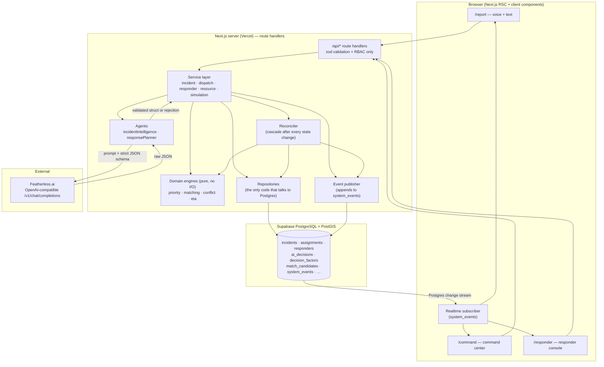
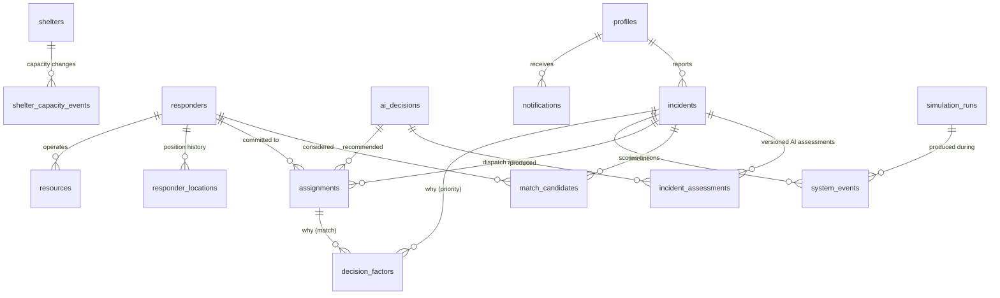
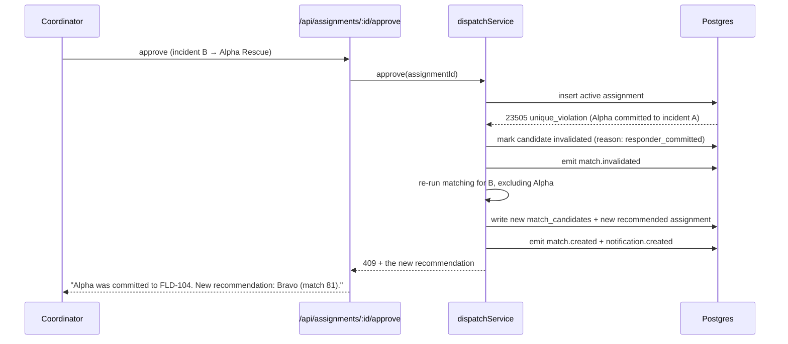

# ReliefOS — System Architecture (Phase 1 Design)

**Real-Time AI Emergency Coordination Operating System**
*From scattered reports to coordinated action.*

> Status: **DESIGN — awaiting approval before implementation.**
> Nothing in this document is implemented yet. Every claim here is a *plan*, and the
> README will only ever claim what the honesty ledger in §23 permits.

---

## 0. Locked decisions and constraints

| Decision | Choice | Why |
|---|---|---|
| Framework | Next.js 15 App Router + TypeScript | Team's fastest stack; one deploy target; server route handlers give a genuine server-side service layer |
| Database | Supabase PostgreSQL 17 (+ PostGIS) | Managed Postgres, PostGIS available, and Realtime is a Postgres change-stream — no separate socket server to build or host |
| Realtime | Supabase Realtime on an append-only `system_events` table | The event log **is** the bus. One artifact serves timeline, audit and live updates |
| AI inference | Featherless.ai (OpenAI-compatible), server-side only | Hackathon requirement; used as a decision component, not a text generator |
| Map | MapLibre GL JS + free raster tiles (no API key) | No vendor key to leak or expire mid-demo |
| Deploy | Vercel + Supabase | Free tier, fast, matches stack |
| Build window | 8–14 hours | Sets the P0/P1/P2 line in §20 |
| Auth | Supabase Auth + role in `profiles`, all writes server-side | Real RBAC without spending hours on RLS write policies |

**Non-negotiable engineering rule for this build:** every button calls a route handler,
every route handler calls a service, every service writes to Postgres and appends a
`system_events` row. If a feature cannot reach the database, it does not ship.

---

## 1. The product in one screen

ReliefOS is a lightweight **AI Emergency Operations Center**.

The problem is not collecting reports. The problem is that during an emergency,
information is fragmented across citizens, responders, volunteers, shelters and
coordinators, and it changes faster than any human can re-derive the right next action.

ReliefOS answers one question, continuously:

> *Given everything known right now, what should happen next, who should do it, and why?*

Three user roles:

- **Citizen** — reports an emergency by voice or text at `/report`. Sees status of their report.
- **Coordinator** — lives in the command center at `/command`. Approves, modifies, rejects, escalates, reassigns.
- **Responder** — works from `/responder`. Accepts assignments and moves through en route → on scene → completed.

---

## 2. System architecture



**Read the diagram as the contract.** The AI never writes to the database. The AI returns
a *proposal*; the service validates it, the deterministic engines score it, the repository
persists it, the event publisher announces it, and only then does any UI change.

### Why this shape

- **AI cannot corrupt state.** A malformed or hostile model output fails schema validation
  before it reaches a repository. Worst case is a rejected assessment and a deterministic fallback.
- **Decisions are reproducible.** Priority and match scores come from pure functions over
  validated inputs. Given the same inputs, the same score — every time, testable in Vitest,
  explainable to a judge. The AI supplies *judgment about the text*; arithmetic stays deterministic.
- **One source of truth for "what happened".** Timeline, audit trail and realtime feed are the
  same rows. There is no way for the UI to animate an event that did not occur in the database.

---

## 3. Module map

```
reliefos/
├─ app/
│  ├─ page.tsx                        landing
│  ├─ report/page.tsx                 citizen voice/text reporting
│  ├─ command/page.tsx                command center (map + queue + timeline)
│  ├─ command/incidents/[id]/page.tsx incident detail + AI decision panel
│  ├─ responder/page.tsx              responder console
│  └─ api/…                           route handlers (§12)
├─ components/
│  ├─ command/  map/  incidents/  responders/  timeline/  ui/
├─ lib/
│  ├─ ai/         provider.ts · featherless.ts · fallback.ts · schemas.ts · prompts/
│  ├─ agents/     incidentIntelligence.ts · responsePlanner.ts · opsSummarizer.ts
│  ├─ domain/     priority.ts · matching.ts · conflict.ts · eta.ts · weights.ts   ← PURE
│  ├─ services/   incidentService · dispatchService · responderService
│  │              resourceService · reconciler · simulationService
│  ├─ repositories/ incidents · responders · assignments · matches · events · ai
│  ├─ events/     publish.ts · types.ts
│  ├─ realtime/   useReliefStream.ts (client) · applyEvent.ts
│  ├─ supabase/   server.ts · browser.ts · admin.ts
│  └─ auth/       rbac.ts · session.ts
├─ supabase/migrations/*.sql
├─ tests/         unit/ · integration/ · fixtures/
└─ docs/          ARCHITECTURE.md · DEMO.md
```

`lib/domain/*` imports nothing from Supabase, Next or the AI client. That is what makes the
core decision logic unit-testable in milliseconds and impossible to accuse of being a prompt.

---

## 4. Database / ER design



### Core tables (abbreviated DDL)

```sql
-- identity & roles
profiles(id uuid pk → auth.users, role text check in
         ('citizen','coordinator','responder','admin'),
         display_name text, org text, created_at timestamptz)

-- the incident record: AI-extracted fields + deterministic scores
incidents(
  id uuid pk, code text unique,                    -- FLD-104
  status text check in ('new','assessing','matched','awaiting_approval',
                        'dispatched','en_route','on_scene','resolved','cancelled'),
  hazard_type text, description_raw text, source text check in ('text','voice','simulation'),
  location geography(Point,4326), address_text text, location_confidence text,
  severity text, people_affected int, vulnerability_flags text[],
  required_capabilities text[], urgency numeric, life_risk boolean,
  ai_confidence numeric, missing_information text[],
  priority_score numeric, priority_band text,
  priority_computed_at timestamptz, assessment_version int,
  reported_by uuid → profiles, is_simulated boolean default false,
  created_at, updated_at, resolved_at)

-- every AI assessment ever made for an incident, versioned (proves reprioritization)
incident_assessments(id, incident_id, version int, ai_decision_id,
  structured jsonb, trigger text, created_at)

-- responders and what they can do
responders(id, name, org, type, status check in
  ('available','en_route','on_scene','busy','offline'),
  capabilities text[], current_load int, max_concurrent int,
  base_location geography(Point,4326), current_location geography(Point,4326),
  speed_kmh numeric, is_simulated boolean, updated_at)
responder_locations(id, responder_id, location geography, recorded_at)

-- scored options with full transparency, including exclusions
match_candidates(id, incident_id, responder_id, rank int, score numeric,
  factors jsonb, eligible boolean, exclusion_reason text,
  computed_at, invalidated_at, invalidation_reason)

-- the actual commitment
assignments(id, incident_id, responder_id, status check in
  ('recommended','awaiting_approval','dispatched','accepted','declined',
   'en_route','on_scene','completed','cancelled','invalidated'),
  match_score numeric, match_factors jsonb, ai_decision_id,
  requires_approval boolean, approved_by uuid, approved_at,
  created_at, updated_at)

-- HARD DB-LEVEL CONFLICT GUARD: one active commitment per responder
create unique index one_active_assignment_per_responder
  on assignments(responder_id)
  where status in ('dispatched','accepted','en_route','on_scene');

-- resources / shelters
resources(id, kind, owner_responder_id, quantity_total int,
  quantity_available int, location geography, is_simulated)
shelters(id, name, location geography, capacity_total int,
  capacity_used int, status, is_simulated)
shelter_capacity_events(id, shelter_id, delta int, reason, created_at)

-- verifiable AI record (§34 of the brief)
ai_decisions(id, incident_id, agent text, provider text, model text,
  prompt_version text, input_summary text, structured_output jsonb,
  confidence numeric, latency_ms int, prompt_tokens int, completion_tokens int,
  validation_status text check in ('valid','repaired','rejected'),
  fallback_used boolean, error_text text, created_at)

-- the "WHY THIS DECISION?" panel, straight from the database
decision_factors(id, subject_type check in ('priority','match'), subject_id uuid,
  label text, detail text, contribution numeric, direction text, created_at)

-- append-only: timeline + audit log + realtime bus, all in one
system_events(id uuid, seq bigserial unique, type text, entity_type text,
  entity_id uuid, incident_id uuid, actor_type check in ('system','ai','user'),
  actor_id uuid, payload jsonb, simulation_run_id uuid, created_at)

notifications(id, target_role text, target_user uuid, severity, title, body,
  incident_id, created_at, read_at)
simulation_runs(id, scenario text, status, started_at, current_step int,
  steps jsonb, ended_at)
```

**Indexes:** `incidents(status, priority_score desc)`, GIST on `incidents.location`,
GIST on `responders.current_location`, `system_events(seq desc)`,
`match_candidates(incident_id, score desc)`, `assignments(incident_id) where status not in ('invalidated','cancelled')`.

**Deliberate omissions.** The brief lists `incident_events`, `audit_logs`,
`responder_capabilities`, `resource_inventory` and `shelter_capacity` as separate tables.
`system_events` already carries actor, entity and payload, so `incident_events` and
`audit_logs` would be the same rows written twice — they are folded in, and the README
will say so. Capabilities are a `text[]` with a GIN index rather than a join table because
nothing in this system ever queries capabilities independently of a responder. Empty tables
are worse than absent ones.

---

## 5. Featherless integration

### Provider abstraction

```ts
interface AIProvider {
  name: string;
  complete(req: { system: string; user: string; schema: JSONSchema;
                  maxTokens: number; temperature: number }): Promise<RawCompletion>;
  health(): Promise<{ ok: boolean; latencyMs?: number; error?: string }>;
}
```

- `FeatherlessProvider` — POSTs to `${FEATHERLESS_BASE_URL}/chat/completions`
  (OpenAI-compatible, called through the `openai` SDK with a custom `baseURL`),
  `response_format: { type: 'json_object' }`, temperature `0.1`, 12s timeout, one retry on 5xx/timeout.
- `DeterministicFallbackProvider` — **not an AI**. A keyword/regex extractor over the report text
  used only when Featherless is unreachable or returns unusable output twice. It sets
  `fallback_used = true`, caps `confidence` at `0.35`, and the UI renders a visible
  **"DEGRADED — rule-based assessment"** badge on that incident.

Environment (never `NEXT_PUBLIC_`, never committed):

```
FEATHERLESS_API_KEY=…
FEATHERLESS_BASE_URL=https://api.featherless.ai/v1
FEATHERLESS_MODEL=<open-weight instruct model, pinned>
FEATHERLESS_MODEL_FALLBACK=<smaller/faster model>
```

### The validation ladder

Every model call passes through the same four gates before it can influence anything:

1. **Transport** — non-2xx, timeout or empty body → retry once → provider error.
2. **Parse** — extract the first balanced JSON object; unparseable → repair attempt.
3. **Schema** — `zod` `safeParse` against the stage schema (§6). Failure → one *repair*
   call that feeds the model its own output plus the validation errors and asks for
   corrected JSON only. Still failing → **reject**.
4. **Sanity** — bounds and cross-field rules the schema cannot express:
   `people_affected ≤ 500`, `urgency ∈ [0,1]`, `confidence ∈ [0,1]`,
   `required_capabilities ⊆ CAPABILITY_ENUM`, `severity='critical' ⇒ urgency ≥ 0.5`.
   Out-of-bounds values are clamped and the decision is marked `repaired`; unknown enum
   members are dropped, not invented.

Every outcome — `valid`, `repaired`, `rejected` — is written to `ai_decisions` with latency and
token counts. A rejected decision never touches `incidents`; the incident stays on its previous
assessment version and the system emits `ai.assessment_rejected`. **The system never crashes
because a model returned bad JSON, and it never silently pretends the model succeeded.**

---

## 6. AI agent workflow

Three stages. Two are P0 and both change what the system does; the third is decoration
and is explicitly P2.

### Agent 1 — Incident Intelligence *(P0, the load-bearing one)*

**Input:** raw report text (typed or transcribed), coarse location, reporter-supplied hints.
**Output schema (zod → JSON Schema in the prompt):**

```jsonc
{
  "hazard_type": "flood|fire|building_collapse|medical|trapped|gas_leak|road_block|other",
  "severity": "critical|high|medium|low",
  "people_affected": 4,
  "vulnerability_flags": ["elderly","child","injured","pregnant","disabled",
                          "infant","unconscious","non_swimmer","isolated"],
  "life_risk": true,                  // immediate threat to life without intervention
  "required_capabilities": ["flood_rescue","boat","medical_first_aid","evacuation"],
  "urgency": 0.94,                    // 0..1
  "confidence": 0.91,                 // 0..1, the model's own certainty
  "missing_information": ["exact floor number"],
  "short_summary": "≤140 chars, control-room phrasing"
}
```

**Consumed by:** the priority engine (§7) and the matching engine (§8) — *every single field
except `short_summary` changes a number or a query*. `missing_information` becomes the
follow-up question shown to the citizen.

### Agent 2 — Response Planner *(P0)*

**Input:** the structured incident + the **top 3 deterministically scored candidates only**.
**Output:**

```jsonc
{
  "recommended_responder_id": "<uuid, MUST be one of the 3 supplied>",
  "rationale_bullets": ["≤3 short factual bullets"],
  "risk_notes": ["optional operational caveats"],
  "requires_human_approval": true
}
```

**Guard rail:** if `recommended_responder_id` is not in the supplied candidate set, the
output is rejected and the deterministic rank-1 candidate is used. The planner may reorder
within the top 3 and must justify it; it can never conjure a responder, and it can never
*lower* `requires_human_approval` below what the policy in §9 demands.

### Agent 3 — Operations Summarizer *(P2)*

A rolling control-room summary of the last N events. Pure narration. Cut first if time runs short.

### Chain-of-thought policy

Prompts explicitly forbid reasoning text — JSON only. Nothing resembling internal reasoning is
stored or rendered. What the coordinator sees is the **decision-factor table from the database**:

```
Priority  CRITICAL (78)          Confidence 91%
✓ Immediate life risk reported            +12.0
✓ Severity assessed critical              +34.0
✓ Vulnerable person present (elderly)      +7.0
✓ Trapped / isolated                       +4.0
✓ 2 people affected                        +8.7
✓ High urgency language                   +13.2
− Model confidence below certainty         −0.5
```

Those rows are `decision_factors`, written by the deterministic engine. Explainable, and
verifiable against the database — not a paragraph the model wrote about itself.

---

## 7. Priority engine (deterministic, configurable, reproducible)

`lib/domain/priority.ts` — a pure function. Weights live in `lib/domain/weights.ts`.

```
score = clamp(0, 100,
    SEVERITY[severity]                      // critical 34 · high 25 · medium 15 · low 7
  + (life_risk ? 12 : 0)
  + min(16, Σ VULNERABILITY[flag])          // unconscious 12 · injured 9 · infant 8 · elderly 7
                                            // pregnant 7 · disabled 7 · child 6 · non_swimmer 4 · isolated 4
  + min(16, 5.5 * log2(1 + people_affected))
  + 14 * urgency
  + min(8, 0.2 * minutes_awaiting_dispatch) // ages up unassigned incidents; freezes on dispatch
  + 6 * (1 - min(1, capability_supply_ratio))
  - 6 * (1 - ai_confidence)
)

band = score ≥ 75 CRITICAL | ≥ 55 HIGH | ≥ 32 MEDIUM | else LOW
```

`capability_supply_ratio` = available responders holding the required capability ÷ open
incidents demanding it. When rescue capacity is exhausted, every waiting rescue incident
gains up to 6 points — the queue reacts to the state of the whole system, not just to its own text.

Each term is written as a `decision_factors` row. Priority is **never** an LLM output; the
LLM supplies `severity`, `urgency`, `people_affected`, `vulnerability_flags`, `life_risk`
and `confidence`, and arithmetic does the rest. Change the report, the fields change, the
score changes — which is exactly the "no hardcoded AI decisions" test in §33 of the brief,
and it is covered by a fixture table in Vitest.

**Recomputation triggers** (all call `reconciler.recomputePriority(incidentId, trigger)`):

| Trigger | Event emitted |
|---|---|
| New assessment (initial or citizen update) | `incident.priority_changed` if band or ±3 points move |
| Assignment invalidated / responder declined | `incident.priority_changed` |
| Responder pool changes (status → offline/available) | recompute for incidents needing that capability |
| Shelter/resource availability change | recompute affected incidents |
| Time tick (chaos tick or `/api/system/tick`) | age-based recompute for undispatched incidents |
| Coordinator escalation | forced band override, recorded with `actor_type='user'` |

---

## 8. Need ↔ Help matching engine

`lib/domain/matching.ts` — also pure. Runs against candidates fetched by a PostGIS query:

```sql
select * from responders
where status in ('available','en_route')
  and capabilities && $required_capabilities         -- array overlap, GIN indexed
  and ST_DWithin(current_location, $incident_point, $radius_m)
order by ST_Distance(current_location, $incident_point);
```

**Hard gates** (excluded, with `exclusion_reason` persisted so the UI can show *why not*):
already committed to an active assignment · `offline` · zero capability overlap ·
`current_load ≥ max_concurrent` · beyond 25 km radius.

**Score, 0–100:**

| Factor | Max | Formula |
|---|---|---|
| Capability coverage | 30 | `30 × matched_required / total_required` |
| Availability | 20 | available 20 · en route to a *lower-priority* incident 8 · wrapping up 5 |
| Proximity | 20 | `20 × exp(−km / 8)` |
| Estimated response time | 15 | `15 × (1 − min(1, eta_min / 45))` |
| Workload headroom | 10 | `10 × (1 − load / max_concurrent)` |
| Specialization | 5 | exact responder-type match for the hazard |

`eta_min = (km / speed_kmh) × 60 × congestion_factor`, with per-type speeds (boat 18,
ambulance 35, volunteer on foot/bike 20 km/h). **This is a straight-line estimate. No routing
service is integrated, and the UI labels every ETA "est. (straight-line)".** Chaos Mode can raise
`congestion_factor`, which legitimately re-ranks candidates.

**Recommendation policy:** rank-1 score ≥ 50 → recommend. Below 50 → no auto-recommendation;
the incident is flagged `NO STRONG MATCH — manual assignment required` and raised to the coordinator.
Weak candidates are still listed with their scores. The system never invents a responder to look decisive.

---

## 9. Conflict resolution & approval policy

Two responders cannot hold the same active assignment. This is enforced **in Postgres**, not in
application logic that might be wrong:

```sql
create unique index one_active_assignment_per_responder …
```

**Flow when the guard fires** (`dispatchService.approve()`):



**Preemption** is offered, never taken automatically. If incident B outranks A by ≥ 15 points
and A's responder is not yet `on_scene`, the planner surfaces a *reassign* proposal
that requires explicit coordinator approval and writes both `assignment.cancelled` (A) and
`assignment.created` (B) plus a `decision_factors` record for the trade-off.

**Approval policy (`requires_approval`):**

| Situation | Path |
|---|---|
| Band CRITICAL or HIGH | Always coordinator approval |
| Any preemption or reassignment | Always coordinator approval |
| Match score < 70 | Always coordinator approval |
| Band MEDIUM/LOW · score ≥ 70 · responder available · no preemption | Auto-dispatch, **only if `AUTO_DISPATCH_ENABLED=true`** (default `false`) |

Auto-dispatch stays off during the demo. The point of the product is that AI proposes and a human commits.

---

## 10. Dynamic reprioritization — the reconciler

`lib/services/reconciler.ts` is the piece that makes ReliefOS a system rather than a form.
**Every** service call that mutates state ends by handing control to the reconciler, which:

1. determines the blast radius of the change (which incidents could be affected),
2. recomputes priority for those incidents,
3. invalidates match candidates whose assumptions no longer hold,
4. re-runs matching where a recommendation was invalidated or the band changed,
5. writes new recommendations and notifications,
6. appends every resulting event to `system_events`.

| Change | Blast radius |
|---|---|
| Responder goes offline | Their active assignment → `invalidated`; that incident re-matched; all open incidents needing their capability re-scored for scarcity |
| New CRITICAL incident arrives | Scarcity term recomputed for competing incidents; existing weak recommendations re-evaluated |
| Citizen adds "my father is unconscious" | New assessment version → priority up → band change → queue reorder → re-match |
| Shelter capacity drops to 0 | Incidents whose plan routed there flagged; alternative shelter search; coordinator notified |
| Assignment declined by responder | Candidate invalidated with reason, next-best recommended |
| Time passes with no dispatch | Age term grows; a MEDIUM incident can climb into HIGH on its own |

The cascade runs synchronously inside the originating request. This is a deliberate choice:
Vercel's serverless model has no reliable long-lived background worker, and a synchronous
cascade is fully traceable in `system_events` with a shared `correlation_id`. Documented as
a limitation in the README, not hidden.

---

## 11. The autonomous workflow, end to end

One citizen report, one HTTP request, seventeen real operations:

| # | Operation | Where | Persisted / emitted |
|---|---|---|---|
| 1 | Receive report | `POST /api/incidents` | — |
| 2 | Validate + rate-limit | route handler (zod) | 400 on bad input |
| 3 | Store raw report | `incidentRepo.create` | `incidents` row, status `new` |
| 4 | Emit received | event publisher | `incident.created` |
| 5 | Call Featherless | `agents/incidentIntelligence` | `ai_decisions` row |
| 6 | Validate output (4 gates) | `ai/validate` | `validation_status` |
| 7 | Persist assessment | `incident_assessments` v1 | `ai.assessment_created` |
| 8 | Compute priority | `domain/priority` | score, band, `decision_factors` |
| 9 | Emit priority | publisher | `incident.priority_changed` |
| 10 | PostGIS candidate search | `responderRepo.nearbyCapable` | — |
| 11 | Score candidates | `domain/matching` | `match_candidates` rows (incl. exclusions) |
| 12 | Planner picks + justifies | `agents/responsePlanner` | second `ai_decisions` row |
| 13 | Create recommendation | `dispatchService` | `assignments` row `awaiting_approval` |
| 14 | Emit + notify | publisher | `match.created`, `notification.created` |
| 15 | Coordinator approves | `POST /api/assignments/:id/approve` | status → `dispatched`, `approved_by` |
| 16 | Responder accepts → en route → on scene → completed | responder endpoints | status transitions + events |
| 17 | Reconcile | `reconciler` | responder freed, queue re-scored |

Every row above is inspectable in Supabase during the demo. That is the answer to
"is this a single-prompt wrapper?"

---

## 12. API contracts

All handlers: zod-validated body, role check via `requireRole()`, structured error envelope
`{ error: { code, message, details? } }`, and a list of events they emit.

### Citizen
| Method | Route | Role | Body | Emits |
|---|---|---|---|---|
| POST | `/api/incidents` | public (rate-limited) | `{description, lat, lng, source:'text'\|'voice', address_hint?}` | `incident.created`, `incident.priority_changed`, `match.created` |
| POST | `/api/incidents/:id/updates` | public (own report) | `{description}` | `incident.updated`, `incident.priority_changed`, possibly `match.invalidated` |
| GET | `/api/incidents/:id/public` | public | — | — |

### Coordinator
| Method | Route | Body | Emits |
|---|---|---|---|
| GET | `/api/incidents?status=&band=&bbox=` | — | — |
| GET | `/api/incidents/:id` | returns incident + assessments + factors + candidates + assignments + events | — |
| POST | `/api/assignments/:id/approve` | `{note?}` | `assignment.created`, `responder.status_changed`, `notification.created` |
| POST | `/api/assignments/:id/reject` | `{reason}` | `match.invalidated`, `match.created` |
| POST | `/api/incidents/:id/reassign` | `{responder_id, reason}` | `assignment.cancelled`, `assignment.created` |
| POST | `/api/incidents/:id/escalate` | `{band, reason}` | `incident.priority_changed` |
| POST | `/api/incidents/:id/rematch` | — | `match.created` |
| POST | `/api/incidents/:id/resolve` | `{outcome_note}` | `incident.updated`, `responder.status_changed` |

### Responder
| Method | Route | Body | Emits |
|---|---|---|---|
| PATCH | `/api/responders/:id/status` | `{status}` | `responder.status_changed` (+ cascade) |
| PATCH | `/api/responders/:id/location` | `{lat,lng}` | `responder.location_changed` |
| POST | `/api/assignments/:id/accept` | — | `assignment.accepted` |
| POST | `/api/assignments/:id/decline` | `{reason}` | `assignment.declined`, `match.created` |
| POST | `/api/assignments/:id/arrive` \| `/complete` | — | `assignment.updated` |

### Resources, simulation, system
| Method | Route | Notes |
|---|---|---|
| PATCH | `/api/shelters/:id/capacity` | `{delta, reason}` → `resource.updated` + cascade |
| PATCH | `/api/resources/:id/inventory` | `{delta}` → `resource.updated` |
| POST | `/api/simulation/seed` | seeds labelled demo responders/shelters/incidents |
| POST | `/api/simulation/chaos/start` | `{scenario}` → creates `simulation_runs` row |
| POST | `/api/simulation/chaos/tick` | executes steps whose offset is now due (§15) |
| POST | `/api/simulation/chaos/stop` / `/api/simulation/reset` | |
| GET | `/api/system/status` | Featherless health, last latency, fallback rate, DB ok, event lag |
| GET | `/api/events?after_seq=` | REST catch-up when realtime drops |

---

## 13. Realtime event architecture

**Channel:** one Supabase Realtime subscription to `postgres_changes` → `INSERT` on
`public.system_events`. Every event carries a monotonic `seq` and a payload containing the
updated entity snapshot, so the client patches its cache without a refetch storm.

**Event catalog** (`lib/events/types.ts`, a discriminated union — the single source of truth
shared by publisher and client):

```
incident.created            incident.updated           incident.priority_changed
incident.resolved           ai.assessment_created      ai.assessment_rejected
responder.status_changed    responder.location_changed
match.created               match.invalidated
assignment.created          assignment.accepted        assignment.declined
assignment.updated          assignment.cancelled
resource.updated            shelter.capacity_changed
notification.created        simulation.step_executed   system.degraded
```

**Client (`useReliefStream`):**

- subscribes on mount, tracks `lastSeq`;
- **gap detection** — if an arriving `seq > lastSeq + 1`, it calls `GET /api/events?after_seq=lastSeq`
  and replays the missing events, so a dropped packet cannot leave the map silently stale;
- on disconnect: visible `LIVE / RECONNECTING / OFFLINE` pill in the header, exponential-backoff
  resubscribe, and a REST refetch of all collections on recovery;
- TanStack Query holds the entity caches; `applyEvent(queryClient, event)` maps each event type
  to a targeted cache patch plus a map/timeline animation.

Every animation in the UI is triggered by one of these rows existing in Postgres. There is no
timer in the frontend that invents motion.

---

## 14. Frontend architecture

### Routes

| Route | Purpose |
|---|---|
| `/` | Landing: *"When every second matters, coordination becomes the emergency."* → `[ENTER COMMAND CENTER]` `[RUN DEMO]` |
| `/report` | Citizen reporting — big mic button, live transcript, pipeline stage indicator |
| `/command` | The product: map + priority queue + metrics + timeline + notifications |
| `/command/incidents/[id]` | Incident detail, AI decision card, candidate table, approval controls |
| `/responder` | Responder console — status control, current assignment, state transitions |

### Command center layout

```
┌──────────────────────────────────────────────────────────────────────┐
│ RELIEFOS   ACTIVE 12 │ CRITICAL 3 │ RESPONDERS 5/9 │ SHELTER 62%      │
│                                    ● LIVE   AI: OK 840ms  [CHAOS ▶]  │
├───────────────────────────────────────┬──────────────────────────────┤
│                                       │  AI PRIORITY QUEUE           │
│         MapLibre GL                   │  ┌────────────────────────┐  │
│   NEED  🔴 critical 🟠 high           │  │ CRITICAL 78  FLD-104   │  │
│         🟡 medium  🟢 resolved        │  │ 2 people · elderly     │  │
│   HELP  🔵 rescue 🟣 volunteer        │  │ AI: Alpha Rescue · 92% │  │
│         🟢 shelter 🟡 medical         │  │ [ REVIEW ]             │  │
│   ── link line = active assignment    │  └────────────────────────┘  │
├───────────────────────────────────────┴──────────────────────────────┤
│ EVENT TIMELINE   14:32:04 INCIDENT_RECEIVED → AI_CLASSIFIED → …      │
└──────────────────────────────────────────────────────────────────────┘
```

### Key components

`MetricStrip` · `LiveMap` (incident + responder layers, assignment link lines, pulse on
`incident.created`) · `PriorityQueue` (sorted by `priority_score`, animates on reorder) ·
`IncidentCard` · `DecisionPanel` (renders `decision_factors` — the WHY block) ·
`CandidateTable` (scores, factor breakdown, and excluded responders with reasons) ·
`ApprovalControls` (Approve / Modify / Reject) · `EventTimeline` (virtualised, newest first) ·
`ResponderBoard` · `ShelterCapacityBar` · `NotificationToaster` · `ConnectionPill` ·
`SystemStatusChip` (Featherless health, degraded badge) · `SimulationBanner`.

### State

Server components fetch initial data → TanStack Query owns client caches → `useReliefStream`
patches them from realtime events. No global store of truth in the browser; a hard refresh
always reproduces the server's state exactly.

### Visual language

Operations console, not a landing page: dark neutral base (`zinc-950/900`), one accent per
priority band (red/amber/yellow/green), one accent for help (blue/violet), dense tabular type,
tabular numerals, 8px grid. No gradient hero cards, no glassmorphism, no decorative counters.
Motion only where it encodes a state change: map pulse on arrival, queue row slide on reorder,
link line draw on dispatch, factor bars on assessment.

### Voice pipeline (P1, first thing built after P0)

```
Web Speech API (browser, Chrome) → interim + final transcript
   → POST /api/incidents { source: 'voice' }        ← the same endpoint text uses
   → identical server pipeline
UI stages: LISTENING → UNDERSTANDING → ASSESSING → MATCHING → ACTION READY
```

Stage labels are driven by the actual request lifecycle and arriving events, not a timer.
Browser speech recognition is Chrome/Edge only; the panel falls back to a textarea elsewhere
and the README states this plainly. No separate "voice demo" path exists — voice and text
converge on one endpoint.

---

## 15. Simulation Mode & Chaos Mode (honest design)

Both drive **the same services and endpoints as real user actions**. The only difference is
`is_simulated = true` on generated rows and a persistent `SIMULATION MODE` banner.

**Seed:** ~8 labelled demo responders, 3 shelters, 4 background incidents around a Hyderabad
bounding box, all clearly fictional identities ("Alpha Rescue (demo)").

**Chaos Mode** — one button, a server-owned script:

```
POST /api/simulation/chaos/start → simulation_runs row with a step script:
  T+0s   create 2 incidents (real POST path, real Featherless calls)
  T+12s  responder Alpha → offline          (real status endpoint)
  T+22s  create 1 CRITICAL incident
  T+32s  shelter Sunrise capacity −40
  T+45s  citizen update on an existing incident ("two more people")
  T+58s  congestion_factor → 1.6
```

The browser calls `POST /api/simulation/chaos/tick` every 2 seconds; **the server** decides
which steps are due from `started_at` and `current_step`, executes them through the normal
services, and appends `simulation.step_executed`. The client is a metronome, nothing more —
it cannot cause a state change the server did not perform.

Why not a server-side timer: Vercel serverless has no durable background loop. This is stated in
the README under Limitations. What the judges see is genuine: priorities recalculate, matches
invalidate, alternatives get found, assignments change, and the map and timeline follow —
all from database rows written by the same code paths a real user exercises.

**Kill switch:** `/api/simulation/reset` deletes every `is_simulated` row and clears the run.

---

## 16. Security model

| Control | Implementation |
|---|---|
| Auth | Supabase Auth (email + password); `profiles.role` ∈ citizen/coordinator/responder/admin |
| Authorization | `requireRole()` guard at the top of every protected route handler; coordinator-only actions verified server-side, never by hiding a button |
| Writes | Exclusively through server route handlers using the service-role client. **RLS is enabled on every table with no client write policies at all** — the browser physically cannot write |
| Reads | RLS read policies: citizens see only their own reports; coordinators/responders see operational data; anonymous sees nothing but the landing page |
| Secrets | `FEATHERLESS_API_KEY` and `SUPABASE_SERVICE_ROLE_KEY` are server-only. Only `NEXT_PUBLIC_SUPABASE_URL` and the anon key reach the browser. `.env.local` gitignored; `.env.example` committed with empty values |
| Input | zod on every body and query; PostGIS coordinates bounds-checked; description length capped |
| Abuse | Token-bucket rate limit per IP on `POST /api/incidents` (in-memory — single-instance limitation, documented) |
| Prompt safety | Report text is passed as a user message with a system prompt that fixes the output contract; model output is data, never executed, never interpolated into SQL |
| Privacy | Demo identities only; no real names or phone numbers stored; public reads round coordinates to ~50 m; `missing_information` never asks for identity documents |

---

## 17. Failure-handling matrix

| Failure | Behaviour |
|---|---|
| Featherless timeout / 5xx | retry once → deterministic fallback extractor → `fallback_used=true`, confidence ≤ 0.35, **DEGRADED** badge on the incident and an amber chip in the header. Incident still gets a priority and a match |
| Malformed JSON | repair call → reject → previous assessment retained → `ai.assessment_rejected` event; state untouched |
| Out-of-range AI values | clamped, `validation_status='repaired'`, both raw and clamped values kept in `ai_decisions` |
| Realtime disconnect | `RECONNECTING` pill → backoff resubscribe → `GET /api/events?after_seq=` replay on recovery |
| Sequence gap | automatic REST catch-up (§13) |
| DB error | typed error envelope, red toast naming the failed operation, no optimistic UI mutation is kept |
| Missing / bad location | incident accepted with `location_confidence='unknown'`, excluded from proximity scoring, flagged in the queue for coordinator geolocation — never silently placed at (0,0) |
| Unique-index conflict on dispatch | the conflict-resolution flow in §9, surfaced as a new recommendation |
| No eligible responder | `NO STRONG MATCH` state + coordinator notification. The system says so rather than assigning someone unsuitable |

---

## 18. Testing strategy

**Unit (Vitest, pure functions, milliseconds):**
- `priority.spec.ts` — fixture table of 12 reports → expected score/band, including the demo
  case and a "one person, minor" case, proving different inputs give different decisions (§33).
- `matching.spec.ts` — gates, ordering, exclusion reasons, ETA maths.
- `conflict.spec.ts` — unique-violation path produces invalidation + alternative.
- `ai-validation.spec.ts` — 8 malformed payload fixtures (truncated JSON, prose wrapper, wrong
  enum, `urgency: 3`, `people_affected: "many"`, null, empty, prompt-injection attempt) all
  rejected or repaired without touching incident state.

**Integration (against a dev Supabase project, Featherless mocked):**
- `pipeline.spec.ts` — the §11 sequence end to end; asserts rows exist in `incidents`,
  `ai_decisions`, `decision_factors`, `match_candidates`, `assignments`, `system_events`.
- `reconciler.spec.ts` — take a responder offline, assert the assignment is invalidated,
  the priority recomputed and the alternative recommended.

**Live AI smoke (`npm run test:ai`, manual):** one real Featherless call validated against the
schema. Proves the integration is live, kept out of CI so no key is needed to build.

**Manual demo checklist:** the judge scenario in §20, run twice before recording.

---

## 19. P0 / P1 / P2 for an 8–14 hour window

**P0 — the system is not real without these (target: hour 7)**
Supabase schema + migrations · repositories · Featherless provider + validation ladder ·
Incident Intelligence agent · priority engine + decision factors · PostGIS candidate search +
matching engine · dispatch service with approval · `system_events` + Realtime · command center
with map, queue and timeline · incident detail with the WHY panel and approval buttons ·
responder console with state transitions · seed data · end-to-end integration test.

**P1 — high value (target: hour 11)**
Voice reporting · Response Planner agent · conflict resolution + preemption proposal ·
notifications · system status/degraded chip · responder decline → re-match · landing page.

**P2 — cut first, in this order**
Ops Summarizer → advanced analytics → resource inventory depth → shelter routing → animations
polish. **Chaos Mode is P2 by the brief's ordering but P1 by demo value** — it is scheduled at
hour 11 and cut only if P0 is not green.

### Hour-by-hour

| Hour | Work | Done when |
|---|---|---|
| 0–1 | Repo, Next.js scaffold, Supabase project, migrations applied, `.env.example`, first commits | `select` on all tables works |
| 1–2 | Repositories, event publisher, seed script, auth + RBAC skeleton | Seeded rows visible via API |
| 2–3.5 | Featherless provider, schemas, validation ladder, Incident Intelligence, `ai_decisions` | Real call returns validated JSON; malformed fixture rejected cleanly |
| 3.5–5 | Priority engine + factors, PostGIS search, matching engine, `match_candidates` | Unit tests green; `POST /api/incidents` returns a scored recommendation |
| 5–7 | Command center: map, queue, detail, WHY panel, approval; realtime subscription | Approve in one tab moves the map in another |
| 7–8 | Responder console + full state machine; reconciler cascade | Responder offline → assignment invalidated → alternative appears live |
| 8–9.5 | Voice reporting; Response Planner; notifications; degraded state | Voice report completes the same pipeline |
| 9.5–11 | Conflict resolution, preemption proposal, Chaos Mode | Chaos run visibly reprioritizes and re-matches |
| 11–12.5 | Integration test, failure tests, security pass, seed reset, Vercel deploy | Deployed URL runs the full demo |
| 12.5–14 | README, architecture diagrams, demo video, final red-team audit (brief §55) | Submission complete |

Commits land continuously in the style listed in §48 of the brief — the history is part of the deliverable.

---

## 20. Three-minute demo flow

| Time | Beat |
|---|---|
| 0:00–0:20 | Command center, live state. *"The hard problem in an emergency isn't receiving information. It's deciding what should happen next."* |
| 0:20–0:50 | Voice report: *"My elderly parents are trapped, water has entered our ground floor."* Show LISTENING → UNDERSTANDING → ASSESSING → MATCHING, and the structured JSON that came back |
| 0:50–1:20 | Priority **CRITICAL 78**, confidence 91%, the decision-factor rows. Then the candidate table with scores *and* excluded responders with reasons |
| 1:20–1:45 | `[APPROVE DISPATCH]` → assignment created → second browser (responder) receives it live → map draws the link line |
| 1:45–2:30 | `[START CHAOS MODE]` → new incidents, Alpha goes offline, shelter capacity drops → queue reorders, a match is invalidated on screen, an alternative is recommended, conflict resolution fires |
| 2:30–3:00 | Event timeline scrolled back through the whole run; Supabase table view open for two seconds on `ai_decisions`. *"ReliefOS doesn't just report what happened. It decides what should happen next, explains why, and adapts when the situation changes."* |

---

## 21. README structure & judge strategy

README follows §41 of the brief exactly, with these load-bearing additions:

- **Architecture diagram** (the mermaid in §2) above the fold.
- **"How AI changes behaviour"** — a table of *AI field → what it changes → where in code*.
  This is the direct answer to "decorative Featherless".
- **Two contrasting runs** — the same demo with a minor incident and with the critical one,
  showing different scores, different candidates, different recommendations. Kills the
  "hardcoded decision" objection with evidence.
- **Verifiability section** — how to open `ai_decisions` and `decision_factors` and read the
  actual model output that drove a decision.
- **Criteria mapping table** (§42) with a file path in every row, not a claim.
- **Limitations** stated up front: straight-line ETAs, no live hazard feed, browser-metronome
  Chaos ticks, Chrome-only speech, simulated identities, single-instance rate limiting.

| Criterion | Evidence |
|---|---|
| Problem & impact | Coordination under uncertainty, not report collection |
| AI implementation | Featherless incident intelligence + planner, validated schemas, `ai_decisions` audit |
| Technical execution | Next.js service layer, Postgres/PostGIS, Realtime, reconciler cascade |
| UX | Voice-first reporting + operations command center + live map |
| Innovation | Need↔Help matching, dynamic reprioritization, DB-enforced conflict resolution |
| Demo | Autonomous workflow + Chaos Mode + inspectable audit trail |

---

## 22. Technical risks and fallbacks

| Risk | Likelihood | Fallback |
|---|---|---|
| Featherless model slow (>10s) or rate-limited | Medium | Pin a small fast instruct model; 12s timeout; `FEATHERLESS_MODEL_FALLBACK`; deterministic extractor keeps the demo alive |
| Model won't return clean JSON | Medium | `json_object` response format + repair call + reject path; already a designed feature, not an emergency |
| PostGIS unavailable / migration trouble | Low | `create extension postgis` on Supabase; if it fails, haversine in SQL over lat/lng columns — matching logic is unchanged |
| Supabase Realtime flaky on free tier | Medium | Gap detection + REST replay is built in from the start; a 3s polling fallback flips on after 3 failed resubscribes |
| Vercel serverless cold starts during demo | Medium | Warm the deployment before recording; demo can run locally against the same Supabase if needed |
| Chaos Mode races with manual actions | Medium | Steps are server-sequenced by `current_step`; the reconciler is idempotent per event |
| Scope overrun | **High** | The P0 line in §19 is the contract; P2 is cut without discussion at hour 11 |
| Voice unsupported in the recording browser | Low | Record in Chrome; text path is identical and always available |

---

## 23. Honesty ledger — what we will never claim

- Not "live government disaster data". All incidents are user-submitted or clearly labelled simulation.
- Not "real-time emergency data" — **real-time application state**.
- Not routed ETAs. Straight-line estimates, labelled in the UI.
- Not production-ready emergency infrastructure. A hackathon prototype in a controlled simulation environment.
- Not autonomous dispatch. AI recommends; a human commits (auto-dispatch is off by default and only ever for low-priority cases).
- No feature appears in the README until it is exercised by the manual checklist in §18.

---

## 24. Open items needing your decision

1. **Supabase project** — your account has only `quorank`. ReliefOS needs its own project
   (creation may prompt a cost confirmation). Approve and I'll create `reliefos` in `ap-south-1`.
2. **Featherless model** — I'll pin a mid-size instruct model with reliable JSON output and set a
   smaller fallback. Tell me if your key is limited to specific models.
3. **GitHub repo name/visibility** — public repo required; confirm the name (`reliefos`?) and
   whether the remote already exists.
4. **Demo geography** — proposed bounding box: Hyderabad around SNIST. Say the word if you'd
   rather use another city.

---

**This document is the plan of record. On approval, implementation starts at hour 0 of §19,
P0 first, with a short written explanation at the end of every subsystem: what it does, why it
exists, which files implement it, how data flows, how to test it, and what can fail.**
